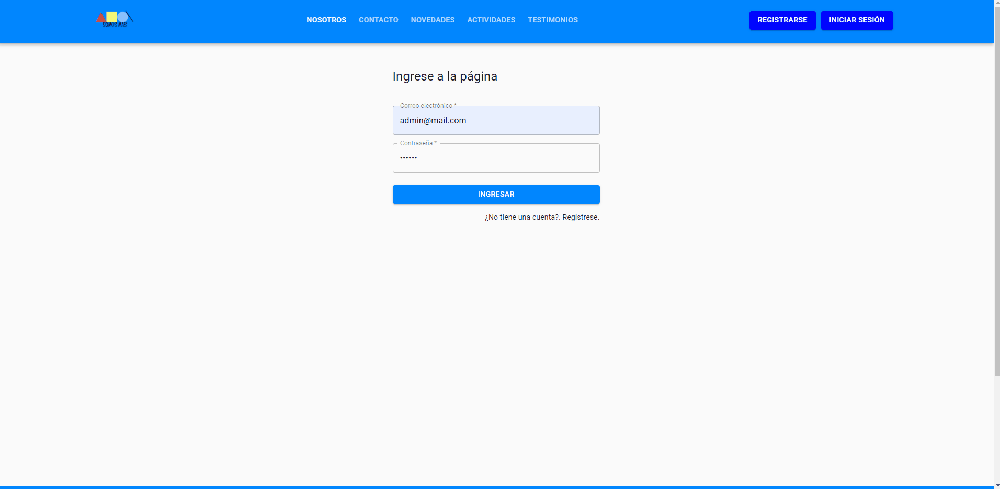

### ¿Qué es esto? 

Proyecto final, realizado en conjunto con más de 10 personas. Entre compañeros, mentores, coordinares, seniors de la industria.

La cual es una aplicación web destinada a la autogestión de una ONG ficticia llamada Somos Más.

----

### Explicación en Profundidad 

Durante la aceleración de Alkemy, participe en el desarrollo de esta página web cuyo objetivo es el de ofrecer una solución de autogestión de su web a una ONG, para que pueda mantener informados a sus usuarios sobre noticias y actividades, que conozcan más sobre la organización y darles la capacidad de contactarse con ellos.
También, darles la posibilidad a los administradores de tener las herramientas necesarias para gestionarla, de forma cómoda e intuitiva.

El proyecto propuesto por Alkemy, es de carácter integral, donde en un grupo de tamaño medio, compuesto entre otros de juniors y seniors, además de coordinadores, analista funcional, entre otros. Trabajando de manera formal como se hace en la industria. Completando dailys, sprints, retros, etc. en la modalidad Scrum.

Mostrando un proyecto final, acabado, testeado y funcionado. A un grupo de personas, simulando una demostración del producto a un cliente final.

----

### Técnologías Utilizadas 

#### Backend
- Java
- Spring Boot
- MySql
- Swagger
- AWS S3
- Spring security
- Sengrid
- Hibernate Jpa

### Demostración 

Podrán observar el código clonando directamente el proyecto.

Lamentrablemente para hacerlo funcionar, deberán contar con credenciales disponibles para AWS S3 y SendGrid.

Pero aquí les dejo unas imagenes/gift del proyecto funcionando.

##### Recorrido del Home:

##### Recorrido del BackOffice para los usuarios administradores:

##### Home desde un dispositivo Mobil:

##### BackOffice desde un dispositivo Mobil:

----

We follow the rules
from [Google Java Style Guide](https://google.github.io/styleguide/javaguide.html).

The code style for this repository is the used by [Google](https://github.com/google/styleguide).
Make sure to set up your IDE with the right code style format fi

Datos seed Usuarios:

User 1:
Pass: 12345
FirstName: Hernesto
LastName: Hernandez
Email: hernestohernandez@gmail.com

User 2:
Pass: 12345
FirstName: Andres
LastName: Garcia
Email: andresgarcia@gmail.com

User 3:
Pass: 12345
FirstName: Camilo
LastName: Martinez
Email: camilomartinez@gmail.com

User 4:
Pass: 12345
FirstName: Enzo
LastName: Lopez
Email: enzolopez@gmail.com

User 5:
Pass: 12345
FirstName: Mauro
LastName: Gonzales
Email: maurogonzales@gmail.com

User 6:
Pass: 12345
FirstName: Rodrigo
LastName: Perez
Email: rodrigoperez@gmail.com

User 7:
Pass: 12345
FirstName: Nicolas
LastName: Rodriguez
Email: nicolasrodriguez@gmail.com

User 8:
Pass: 12345
FirstName: Juan
LastName: Sanchez
Email: juansanchez@gmail.com

User 9:
Pass: 12345
FirstName:Daniel
LastName: Morales
Email: danielmorales@gmail.com

User 10:
Pass: 12345
FirstName: Santiago
LastName: Barrera
Email: santiagobarrera@gmail.com

admin 1:
Pass: 12345
FirstName: Lucia
LastName: Coppari
Email: luciacoppari@gmail.com

admin 2:
Pass: 12345
FirstName: Maria
LastName: Fernandez
Email: mariafernandez@gmail.com

admin 3:
Pass: 12345
FirstName: Laura
LastName: Isuani
Email: lauraisuani@gmail.com

admin 4:
Pass: 12345
FirstName: Patricia
LastName: Leiva
Email: patricialeiva@gmail.com

admin 5:
Pass: 12345
FirstName: Paula
LastName: Dominguez
Email: pauladominguez@gmail.com

admin 6:
Pass: 12345
FirstName: Daniela
LastName: Alvarez
Email: danielaalvarez@gmail.com

admin 7:
Pass: 12345
FirstName: Martina
LastName: Maidana
Email: martinamaidana@gmail.com

admin 8:
Pass: 12345
FirstName: Aldana
LastName: Suarez
Email: aldanasuarez@gmail.com

admin 9:
Pass: 12345
FirstName: Nahir
LastName: Lococco
Email: nahirlococco@gmail.com

admin 10:
Pass: 12345
FirstName: Luciana
LastName: Moreira
Email: lucianamoreira@gmail.com

Link Swagger: http://localhost:8080/swagger-ui/

